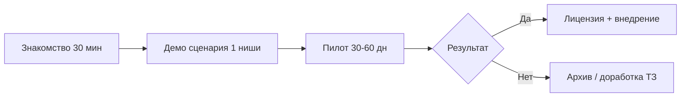

# Комплект для коммерческих заказчиков  
## ДелаЮ (Дела.ЮГИт) · пилоты 2026

**Версия:** 1.1 · **Дата:** 19.05.2026  
**Продукт:** **ДелаЮ** — платформа **ЮГИт** (запись в реестре Минцифры)  
**Связь с гос-треком:** та же платформа; конфигурация **АИС УЖВ** — отдельный контракт; коммерческие модули — отдельные договоры

---

## 1. Что предлагаем — «ДелаЮ»

**ДелаЮ** (*Дела.ЮГИт*) — модульная веб-платформа компании **ЮГИт**: **вести дела в одном месте** — от заявки до документа и отчёта. Сотрудники работают в браузере; руководитель видит статусы и сроки; все изменения фиксируются в журнале аудита.

*Слоган:* **Веду дела — ДелаЮ** · *Полное описание:* `docs/delayu-product-opisanie.md`

| Возможность | Описание |
|-------------|----------|
| Реестр заявлений / дел | Статусы, фильтры, история |
| Роли и права | Кто видит и утверждает |
| Шаблоны документов | docx/pdf из карточки |
| Отчёты | Настраиваемые выгрузки |
| Журнал действий | Аудит изменений |
| Размещение | Облако РФ или сервер заказчика |

**Не обещаем в пилоте:** тяжёлые интеграции (1С, банки, госуслуги) — только по отдельному ТЗ после пилота.

**Преимущество для бизнеса:** **ДелаЮ** в **реестре отечественного ПО** (аргумент для ЛПР, закупки у госкорпораций-партнёров, налоговый вычет на ПО — по консультации бухгалтера). Один продукт в реестре — разные отраслевые модули без покупки отдельной системы под каждую задачу.

---

## 2. Чем коммерция отличается от гос-проекта УЖВ

| | **Гос (УЖВ + ИКТ)** | **Коммерция** |
|---|---------------------|---------------|
| Заказчик | УЖВ + ИКТ | Ваша организация (B2B) |
| Договор | 44-ФЗ после торгов | Прямой договор / оферта |
| Срок | **До 02.10.2026** (жёстко) | **30–60 дней** пилот (гибко) |
| Функционал | Полное ТЗ УЖВ | **1 ниша = 1 сценарий** |
| Сервер | ИКТ администрации | Облако РФ / у вас |
| Кастом | В рамках ТЗ и протоколов | Оценка отдельно |

**Правило для исполнителя:** разработка под **контракт УЖВ** не смешивается с **кастомом коммерции** без отдельного соглашения и сроков — иначе срыв госприёмки.

---

## 3. Целевые ниши (приоритет 2026)

| Клиент / ниша | Узкий сценарий пилота | Что берём из ядра платформы |
|---------------|----------------------|----------------------------|
| **Ателика** | Заявки, клиенты, статусы, отчёт по воронке | Реестр заявлений, роли, отчёты |
| **Точно (стройка)** | Объекты, заявки на снабжение/документы по объекту | Справочники, документы, workflow |
| **Юрбюро** | Дела, сроки, шаблоны исков/договоров | Шаблонизатор, календарь сроков, аудит |

**Май–июнь 2026:** фокус на прототипе **модуля УЖВ**; коммерции — **краткая презентация** «дорожная карта модулей» (15–20 мин).

**Июль 2026+:** после стабилизации ядра — **пилот 2–4 недели** на **одном** коммерческом клиенте (выбрать приоритетного).

---

## 4. Этапы работы с коммерческим клиентом

| Этап | Срок | Результат |
|------|------|-----------|
| **0. Знакомство** | 30–45 мин | Понимание процесса «как сейчас» |
| **1. Демо** | 1 встреча | Показ **одного** сценария на стенде |
| **2. Пилот** | 30–60 дней | Рабочий контур на ваших данных (обезличенных или реальных по соглашению) |
| **3. Внедрение** | по смете | Доработки, обучение, сопровождение |
| **4. Сопровождение** | год / помесячно | Обновления, поддержка |

---

## 5. Что входит в пилот (стандартный пакет)

| Входит | Не входит (отдельно) |
|--------|----------------------|
| 1 настроенный сценарий (до 8–10 статусов) | Интеграция с 1С / CRM / телефонией |
| До 5 ролей пользователей | Мобильное приложение |
| До 3 отчётов / выгрузок | Полная миграция истории за 5+ лет |
| 2–3 шаблона документов | ИИ / чат-боты |
| Обучение 4–8 ч | Неограниченный кастом без оценки |
| Стенд: облако РФ или Docker у вас | |

**Данные:** рекомендуется старт с **обезличенной** копии или ограниченного периода (3–6 мес.).

---

## 6. Демо-сценарии по нишам (для встречи)

### Ателика

1. Создание заявки → назначение ответственного → статусы.  
2. Карточка клиента, история контактов.  
3. Отчёт: заявки по статусам за период.

### Стройка (Точно)

1. Карточка объекта → заявка на материалы/документ.  
2. Согласование → прикрепление файлов.  
3. Реестр объектов с фильтром по статусу.

### Юрбюро

1. Карточка дела → сроки (напоминание).  
2. Генерация документа из шаблона.  
3. Журнал: кто и когда менял дело.

---

## 7. Размещение и безопасность

| Вариант | Когда выбирать |
|---------|----------------|
| **Облако РФ** (VPS) | Быстрый старт пилота, нет своего админа |
| **Сервер заказчика** (Docker) | Политика «данные не уходят наружу» |
| **Гибрид** | Пилот в облаке → перенос после договора |

- HTTPS, резервное копирование по регламенту.  
- Роли, разграничение доступа, журнал действий.  
- 152-ФЗ: по запросу — соглашение обработки ПДн и актуализация политики.

---

## 8. Коммерческие условия (рамка для переговоров)

*Цифры — ориентир для обсуждения, не публичная оферта.*

| Пакет | Содержание | Ориентир |
|-------|------------|----------|
| **Пилот** | 1 сценарий, 30–60 дн., стенд | По смете после демо |
| **Внедрение** | Доработки по итогам пилота, обучение | Отдельная смета |
| **Лицензия** | Право использования платформы + модуль | Год / бессрочно — по модели |
| **Сопровождение** | Обновления, консультации | % от лицензии или фикс/мес. |

**Оплата:** предоплата пилота 50–70% · остатое по акту · внедрение — по этапам.

**Права:** исключительные права на платформу — у правообладателя (разработчик); клиенту — лицензия по договору.

---

## 9. Календарь коммерции (параллельно гос-треку)

| Период | Коммерция | Гос (справочно) |
|--------|-----------|-----------------|
| **Май–июнь** | Презентация **ДелаЮ**, выбор 1 пилота | Прототип АИС УЖВ, визиты |
| **Июль** | Старт пилота (если ядро стабильно) | Реестр Минцифры |
| **Август–сент.** | Пилот / первые акты | Закупка и контракт УЖВ |
| **Октябрь+** | Масштабирование 2-й ниши | Приёмка УЖВ |

---

## 10. Вопросы коммерческому заказчику (анкета на 1 встречу)

### Блок 1 — Процесс

1. Какой **один** процесс болит больше всего?  
2. Сколько заявок/дел в месяц?  
3. Сколько сотрудников будут в системе?  
4. Кто утверждает и кто исполняет?

### Блок 2 — Данные и системы

5. Где сейчас ведут учёт (Excel, 1С, CRM, бумага)?  
6. Нужна ли выгрузка в Excel/PDF ежедневно?  
7. Есть ли требование «только на нашем сервере»?

### Блок 3 — Документы и сроки

8. Какие документы генерируют чаще всего (2–3 шт.)?  
9. Есть ли жёсткие сроки (календарь, напоминания)?  
10. Нужен ли журнал «кто что менял»?

### Блок 4 — Решение

11. Кто ЛПР и кто подписывает договор?  
12. Бюджетный коридор на пилот?  
13. Желаемая дата «чтобы уже работало»?

**Заполнить на встрече → приложение к коммерческому предложению.**

---

## 11. Коммерческое предложение — структура (шаблон)

1. **Понимание задачи** (1 абзац своими словами клиента).  
2. **Решение** — **ДелаЮ** + модуль под нишу (ЮГИт).  
3. **Сценарий пилота** (таблица из п. 6).  
4. **Сроки и этапы** (п. 4).  
5. **Состав работ и границы** (п. 5).  
6. **Стоимость** (п. 8).  
7. **ДелаЮ** в реестре отечественного ПО (номер — после записи в июле 2026).  
8. **Контакты.**

---

## 12. Риски (для внутреннего планирования)

| Риск | Митигация |
|------|-----------|
| Кастом съедает ресурс УЖВ | Отдельная оценка, отдельный договор |
| Клиент ждёт «как 1С» | Чёткие границы пилота в КП |
| Нет записи в реестре к продаже госкорпорациям | Указать срок получения № (июль 2026) |
| Пилот без оплаты | Минимальная предоплата + срок пилота в договоре |

---

## 13. Тезис для коммерческого ЛПР (30 секунд)

*«**ДелаЮ** от **ЮГИт** — платформа в реестре отечественного ПО. За 30–60 дней запускаем пилот под **ваш** процесс: заявки, объекты или юридические дела — без тяжёлой интеграции. После пилота — лицензия и внедрение по смете. Отдельно от муниципальной конфигурации АИС УЖВ, но на том же ядре — вы не платите за «ещё одну коробку».»*

---

## 14. Следующий шаг

| Действие | Срок |
|----------|------|
| Выбрать **одного** пилотного клиента (Ателика / стройка / юрбюро) | До 15.06 |
| Провести демо по **одному** сценарию | Июнь |
| Подписать договор пилота + NDA при необходимости | До 01.07 |
| Старт пилота | Июль 2026 |

**Контакт исполнителя:** _______________ · _______________ · _______________
