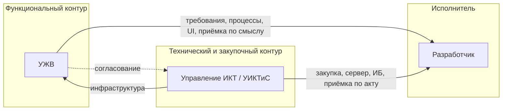
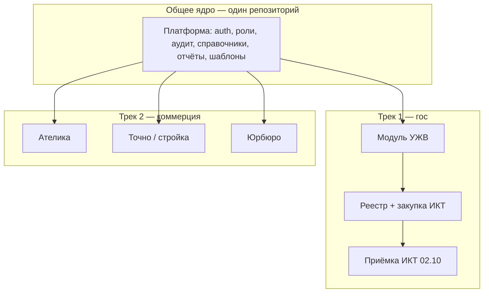

# Модель участников, продукт и два трека (гос + коммерция)

**Дата:** 19.05.2026 · **Версия:** 1.0

---

## 1. Три стороны в госпроекте (не путать роли)

| Роль | Кто | Зона ответственности | Что согласовываем |
|------|-----|----------------------|-------------------|
| **Функциональный заказчик** | **УЖВ** | Жилищные процессы, учёт, отчёты, пользователи | Визиты 1–4: процессы, поля, экраны, регламенты |
| **Технический заказчик / закупщик** | **Управление ИКТ** | Закупка, сервер, сеть, ИБ, **приёмка работ по контракту** | Отдельная сессия ИКТ: стек, размещение, ПМИ, акт |
| **Пользователи** | Сотрудники УЖВ | Ежедневная работа | Обучение, обратная связь на опытной эксплуатации |
| **Исполнитель** | Вы / ваша организация | Разработка, реестр, внедрение | Контракт с тем, кто указан заказчиком в извещении |

**Важно для документов:**

- В **ТЗ на закупку** заказчиком по 44-ФЗ часто выступает **администрация / МКУ «Электронный Краснодар»**, а **ИКТ** готовит извещение и принимает как технический специалист — уточнить юридическое лицо в **A2.1**.
- **Приёмку подписывает ИКТ** (или комиссия под председательством ИКТ + представитель УЖВ) — зафиксировать в **F1.5** до августа.
- УЖВ **не должно** оставаться единственным контактом по серверу — всё размещение через **ИКТ**.

---

## 2. Размещение: модель «на стороне ИКТ»

Если сервер предоставляет **ИКТ** (типично для муниципалитета):

| Тема | Ответственный | Вопрос на сессии ИКТ |
|------|---------------|----------------------|
| ВМ / bare metal / k8s | ИКТ | Где разворачиваем Docker? |
| Astra Linux, Nginx | ИКТ | Версии, кто админит |
| PostgreSQL | ИКТ | Отдельная ВМ или общий кластер |
| VPN / доступ разработчика | ИКТ | VPN, jump-host, GitLab |
| TLS-сертификат | ИКТ | Кто выпускает, срок |
| Резервное копирование | ИКТ | RPO/RTO, кто восстанавливает |
| К3 / ИСПДн | ИКТ + ИБ администрации | Класс, модель угроз |
| Мониторинг | ИКТ | Prometheus/ELK или их аналог |

**Следствие для календаря:** сессия с **ИКТ** — не позже **первой недели июня**, иначе риск «нет сервера к сентябрю».

---

## 3. Универсальный продукт для реестра (не только «АИС УЖВ»)

### 3.1. Зачем

- **Один продукт в реестре** → можно использовать в **других закупках** и **коммерции** (Ателика, стройка, юрбюро).
- **УЖВ** — первая **отраслевая конфигурация** (модуль «Жилищный контур» / «УЖВ»), а не отдельное ПО навсегда только для одного управления.

### 3.2. Рекомендуемая продуктовая схема

| Уровень | Название (рабочее) | В реестре / в контракте |
|---------|-------------------|-------------------------|
| **ДелаЮ** (Дела.ЮГИт) | Платформа **ЮГИт** | **Единая запись в реестре Минцифры** |
| **Конфигурация АИС УЖВ** | Жилищный модуль | Описание в ТЗ закупки как конфигурация **ДелаЮ** |
| **Модули коммерции** | CRM-учёт, заявки, документы… | Отдельные лицензии, тот же реестровый № |

### 3.3. Что прописать в реестре (смысл, не юрформулировка)

- Наименование: **«ДелаЮ»** (линейка **«Дела.ЮГИт»**, правообладатель **ЮГИт**).
- Назначение: модульная веб-платформа для учёта заявлений и дел, документооборота, сроков, отчётности, ролевого доступа. *См. `delayu-product-opisanie.md`.*
- Область: органы власти, муниципальные учреждения, **коммерческие организации** (B2B).
- Модули: жилищный контур (УЖВ), *далее — по мере выпуска*.
- Без привязки только к «Управлению по жилищным вопросам г. Краснодара» в **наименовании** продукта.

### 3.4. Связка с закупкой УЖВ

| Документ | Как писать |
|----------|------------|
| ТЗ на закупку (август) | «Внедрение ПК **«ДелаЮ»**, конфигурация **«АИС УЖВ»**, в соответствии с согласованным ТЗ» |
| Реестр | Запись на **«ДелаЮ»**; в описании — конфигурация АИС УЖВ как первая поставка |
| Контракт | Лицензия на **«ДелаЮ»** + работы по внедрению **АИС УЖВ** |
| Приёмка ИКТ | **ДелаЮ** развёрнут + конфигурация АИС УЖВ по ПМИ |

**Риск:** если в извещении только «АИС УЖВ» без платформы — коммерческие модули не «подвязаны» к той же записи. Решение: **юрист + ИКТ** согласуют формулировку.

---

## 4. Два параллельных трека

| | **Трек 1: УЖВ (гос)** | **Трек 2: коммерция** |
|---|----------------------|------------------------|
| **Заказчик** | УЖВ + ИКТ | Ваши контракты B2B |
| **Деньги** | Контракт после торгов | Пилот / внедрение напрямую |
| **Срок** | Жёстко 02.10.2026 | Гибко, 30–60 дней на пилот |
| **Функционал** | Полное ТЗ УЖВ (без I-xx) | 1 ниша = 1 демо-сценарий |
| **Реестр** | Нужен для закупки | Аргумент для ЛПР (+ вычет) |
| **Сервер** | ИКТ | Облако РФ / у клиента |

**Правило:** не смешивать **разработку под контракт УЖВ** с **кастомом для коммерции** без отдельного соглашения и оценки — иначе срыв сроков госприёмки.

---

## 5. Коммерческие ниши (черновик)

| Клиент | Узкий сценарий для демо | Переиспользование из ядра |
|--------|-------------------------|----------------------------|
| **Ателика** | Заявки, клиенты, статусы, отчёт | Реестр заявлений, роли, отчёты |
| **Точно (стройка)** | Объекты, заявки на снабжение/документы | Справочники, документы, workflow |
| **Юрбюро** | Дела, сроки, шаблоны документов | Шаблонизатор, календарь сроков, аудит |

**Май–июнь:** пока фокус на **прототипе УЖВ**; коммерции — **1 страница** в презентации «дорожная карта модулей».

**Июль+:** после стабилизации ядра — **пилот 2–4 недели** на одном коммерческом клиенте (выбрать одного).

---

## 6. Обновлённый календарь встреч (5 сессий)

| № | Когда | С кем | Фокус |
|---|-------|-------|-------|
| **0** | 22–24.05 | **ИКТ** | Сервер, доступ, ИБ, закупка, приёмка, стек |
| **1** | 26–30.05 | **УЖВ** | Обследование процессов |
| **2** | 09–13.06 | **УЖВ** | Учёт, расчёты, формы |
| **3** | 16–20.06 | **УЖВ** | UI, роли |
| **4** | 23–27.06 | **УЖВ + ИКТ** | MVP, ТЗ закупки, ПМИ, комиссия приёмки |
| *опц.* | июнь | **Коммерция** | 1 презентация платформы (без глубокого ТЗ) |

---

## 7. Тезисы для трёх аудиторий

**УЖВ:** «Вы задаёте, *что* система должна делать; ИКТ обеспечивает *где* она работает и *как* принимается контракт.»

**ИКТ:** «Вы — заказчик инфраструктуры и приёмки; мы приносим платформу в реестре и модуль УЖВ по согласованному ПМИ.»

**Коммерция:** «Та же платформа в реестре, другой модуль — быстрый пилот без госзакупки.»

---

## 8. Следующие шаги

1. ~~Торговое имя~~ — **ДелаЮ** (Дела.ЮГИт); подать в реестр в июне.  
2. Назначить **встречу 0 с ИКТ** (неделя 22–24.05).  
3. В опроснике заполнить блок **Часть I (ИКТ)** — см. `voprosy-k-zakazchiku-uzhv-detalno.md`.  
4. На визите 4 обязательно **председатель приёмки от ИКТ** + функциональная приёмка УЖВ.
