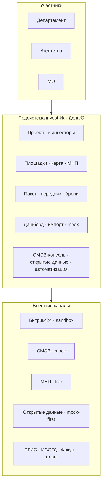

# Пояснительная записка  
## О готовности и запуске подсистемы «Инвестконтур Кубани» (платформа «ДелаЮ»)

**Адресат:** руководитель департамента (экономика / инвестиции)  
**Подготовил:** команда внедрения «ДелаЮ» (ЮГИт)  
**Дата:** июль 2026  
**Версия:** 1.0  

**Назначение документа:** кратко описать текущую реализацию, меры для ввода в эксплуатацию в департаменте и агентстве, порядок подключения внешних сервисов, ориентировочные сроки первого этапа и ответы на типовые вопросы руководства.

Иллюстрации также сохранены в `docs/word/assets/` и встроены в Word-версию (`docs/word/пояснительная-записка-invest-zapusk-2026.docx`).

---

## 0. Резюме для руководителя (1 минута)

| Вопрос | Ответ |
|--------|--------|
| Что уже есть? | Рабочий контур учёта и сопровождения инвестпроектов: проекты, инвесторы, площадки, карта с генпланом МНП, пакет документов, передачи Агентство→Департамент, импорт МО, дашборд, консоли СМЭВ/автоматизации, проверка по открытым данным. |
| Можно ли работать без СМЭВ и Битрикс? | **Да.** Этап 1 рассчитан на самостоятельную работу контура; внешние каналы — задел с демо/песочницей. |
| Что нужно для запуска в департаменте? | Сервер (или контур заказчика), роли и пользователи, пилотные данные, регламенты, обучение, акт опытной эксплуатации. |
| Сколько до промышленного запуска этапа 1? | **6–8 недель** при готовности инфраструктуры и орг. решений; интеграции СМЭВ/Битрикс/РГИС — **отдельный этап 2–6 мес.** |
| Главный риск | Ожидание «сразу живых» СМЭВ/Росреестра/РГИС без регламента и доступов; размытие границ этапа 1. |

---

## 1. Текущая реализация системы

### 1.1. Что это за система

**«Инвестконтур Кубани»** — отраслевая подсистема (`invest-kk`) на платформе **«ДелаЮ»** (линейка «Дела.ЮГИт», правообладатель ЮГИт). Единый контур для:

- **Департамента** — воронка сопровождения и контроля, приём передач, полный дашборд;
- **АНО «Агентство по привлечению инвестиций»** — воронка привлечения, подбор/бронь площадок, пакет к передаче;
- **Муниципалитетов (МО)** — свои проекты/площадки, актуализация, импорт выгрузок.

Данные изолированы в рамках подсистемы; видимость настраивается ролями (МО — своя организация; Департамент/Агентство — весь контур).

### 1.2. Архитектура «как есть»

### 1.3. Функционал по блокам (состояние на июль 2026)

| Блок | Что умеет пользователь | Статус |
|------|------------------------|--------|
| **Обзор / «Сегодня»** | Оперативный inbox, хаб подсистемы | В работе |
| **Проекты** | Реестр, карточка, стадии двух воронок, канбан, паспорт, комментарии, пакет | В работе |
| **Инвесторы** | Карточка, проверка ИНН + открытые данные | В работе (opendata: mock) |
| **Площадки** | Реестр, сравнение, кампании; бронь без коллизий | В работе |
| **Карта** | Яндекс.Карты + слои генплана МНП (WMS/вектор/локальный store) | **Live** (прокси МНП) |
| **Выкопировки** | Реестр, геометрия, пересечение с зонами МНП, стоп-факторы генплана | Demo / import (без live Росреестра) |
| **ФГИС ТП** | Реестр записей, поиск/прикрепление документов (демо-каталог) | Mock |
| **СМЭВ** | Консоль запросов, протокол, эмуляция ответов ЕГРН/ИСОГД/РГИС | **Mock** (live-флаг = «ожидание шлюза») |
| **Открытые данные** | Каталог источников; проверка контрагента и площадки (ФНС, Федресурс, ФССП, КАД, РНП, дисквалифицированные, НСПД и др.) | Mock-first; live — по флагу и allowlist |
| **Передачи (handoff)** | Агентство → Департамент accept/return с контролем пакета | В работе |
| **Импорт МО** | Excel → diff → построчное применение | В работе |
| **Дашборд** | Воронки, SLA, готовность пакетов, выгрузки к совещанию | В работе |
| **Автоматизация** | Админ-флаги: Битрикс, СМЭВ, пакет, эскалации, коннекторы | В работе |
| **Битрикс24** | Webhook inbound + outbound в песочнице; журнал | **Sandbox** (live REST — при отключении sandbox и URL) |
| **Пакет документов** | Чек-лист: ЕГРН, выкопировка, ИСОГД, РГИС, ОИВ, Контур.Фокус, opendata, анкета, меры ГП, протокол | В работе (часть пунктов — слоты под будущие коннекторы) |

### 1.4. Что сознательно не входит в «готовность этапа 1»

- Живой шлюз **СМЭВ** и автоматическая выгрузка ЕГРН из Росреестра  
- Полноценный дуплекс **Битрикс24** в бою (по умолчанию песочница)  
- Коннекторы **РГИС** / **ИСОГД** края (флаги выключены, задел в чек-листе)  
- API **Контур.Фокус** (пункт пакета есть, клиента нет)  
- Публичный личный кабинет инвестора / замена INVEST-ID  
- Полноценный GIS-редактор и live WFS портала ФГИС ТП  

Это не «недоделка», а граница этапа: сначала устойчивый контур учёта и сопровождения, затем внешние каналы.

---

## 2. Технические меры для запуска в департаменте

### 2.1. Инфраструктура

1. **Сервер / контур размещения** (предпочтительно инфраструктура заказчика или аттестованный контур): Ubuntu 24.04 LTS (или согласованная ОС), PostgreSQL 16, Nginx, Gunicorn/systemd, HTTPS.  
   Ориентир по процедуре: `docs/deploy-ubuntu-2404.md`, каталог `/opt/delayu`.
2. **Резервное копирование** БД и media (ежедневно), тест восстановления.
3. **Сетевые доступы:** исходящий HTTPS к МНП (`mnp.economy.gov.ru`), Яндекс.Карты (ключ API), при включении live opendata — к allowlist-хостам; для СМЭВ/РГИС — отдельные каналы по регламенту ведомства.
4. **Секреты** в `.env` / vault: `POSTGRES_*`, `YANDEX_MAPS_API_KEY`, `INVEST_MNP_*`, при необходимости `INVEST_OPENDATA_*`; URL/токен Битрикс — в админке автоматизации.
5. **Миграции и seed:** `migrate`, `seed_invest_kk` (организации, роли, стадии, демо-данные при необходимости отключаются).

### 2.2. Конфигурация продукта

| Мера | Действие |
|------|----------|
| Подсистема | Активировать `invest-kk`, проверить меню и роли |
| Организации | Создать org Департамента, Агентства, пилотных МО |
| Пользователи | Учётные записи, привязка к org/ролям, 2FA при политике ИБ |
| Автоматизация | Оставить `sandbox=True`, `smev_mock=True`, `opendata_mock=True` до готовности внешних доступов |
| МНП | Включить sync/store региона КК (`sync_mnp_kk`), проверить карту |
| Журнал аудита | Включить/проверить логирование действий (платформа) |
| Мониторинг | Healthcheck приложения, диска, БД, алерты |

### 2.3. Данные и миграция

1. Согласовать **формат первичной загрузки** проектов/площадок (Excel/CSV по шаблону импорта МО или разовая миграция).  
2. Нормализовать кадастровые номера, ИНН, коды МО.  
3. Зафиксировать **владельца мастер-данных** (кто правит площадку при конфликте с МО).  
4. Пилот: 1–2 МО + ограниченный портфель проектов Агентства/Департамента.

### 2.4. ИБ и соответствие

- Размещение по требованиям заказчика (в т.ч. требования к ПДн / ГИС — по классификации объекта).  
- Разграничение прав: МО не видит чужие данные; экспорт дашборда — только уполномоченным.  
- Регламент доступа админов вендора на период внедрения (VPN, журнал, срок).

---

## 3. Организационные меры (департамент и агентство)

### 3.1. Роли и ответственность

| Роль | Организация | Зона ответственности |
|------|-------------|----------------------|
| Функциональный заказчик этапа 1 | Департамент | Приоритеты, приёмка, регламенты сопровождения |
| Оператор воронки привлечения | Агентство | Ведение лидов/проектов, пакет, инициация handoff |
| Оператор сопровождения | Департамент | Accept/return, стадии support, контроль SLA |
| Территориальный контур | МО (пилот) | Актуализация площадок, импорт |
| Администратор подсистемы | ИТ заказчика / совместно с вендором | Пользователи, справочники, флаги автоматизации |
| Куратор внедрений | Совместно | Календарь обучения, UAT, протокол опытной эксплуатации |

### 3.2. Регламенты (обязательный минимум до промышленного запуска)

1. **Маршрут проекта:** стадии привлечения и сопровождения, критерии перехода.  
2. **Передача (handoff):** обязательные пункты пакета; сроки ответа Департамента; основания возврата.  
3. **Бронь площадки:** кто бронирует, срок брони, снятие при простое.  
4. **Импорт МО:** периодичность, ответственный за сверку diff, запрет «тихого» overwrite.  
5. **Работа с демо-интеграциями:** до live СМЭВ/Битрикс ответы консоли **не являются** юридически значимыми выписками — только оснастка процесса.  
6. **Эскалации и дашборд:** что считается просрочкой, кто закрывает на совещании.

### 3.3. Обучение и изменение процессов

- Очные/онлайн сессии: Департамент (сопровождение + дашборд), Агентство (привлечение + пакет + handoff), МО (площадки + импорт).  
- Краткие чек-листы «день 1» и видео/PDF по сценариям.  
- Назначить **чемпионов** в каждой org (1–2 человека) для первой линии вопросов.  
- Синхронизировать с текущими практиками Битрикс/таблиц: что переносится в контур сразу, что остаётся вне до этапа интеграций.

### 3.4. Приёмка этапа 1

Критерии (по дизайн-спеке этапа 1):

- Сценарии привлечения → пакет → handoff → сопровождение проходят end-to-end без Битрикс/СМЭВ.  
- Бронь без коллизий; дашборд отражает просрочки и готовность пакетов.  
- Импорт МО с подтверждением строк.  
- Акт опытной эксплуатации и протокол замечаний с приоритетами (P0/P1/P2).

---

## 4. Подключение к СМЭВ и другим внешним сервисам

### 4.1. Общий принцип

В продукте уже есть **точки расширения** (модели запросов, флаги, чек-лист пакета, журнал). Подключение = организационно-правовой доступ + технический адаптер + перевод флага с mock/sandbox на live + приёмка.

| Сервис | Сейчас | Что нужно для боя |
|--------|--------|-------------------|
| **СМЭВ** (ЕГРН и др.) | Mock-консоль | Участник СМЭВ / оператор; сертификаты; шлюз; вид сведений; адаптер; `smev_live`, выключить mock |
| **Битрикс24** | Sandbox webhook + журнал | URL REST/webhook, маппинг полей, отключить sandbox, тест дуплекса |
| **МНП** | Live proxy + local store | Сетевой доступ, sync региона, мониторинг квоты/таймаутов |
| **Открытые данные** | Mock-first | Политика ИБ на исходящие запросы, включение `opendata_live`, доработка live-адаптеров по источникам |
| **РГИС края** | Слот + stub-флаг | ТЗ/API или СМЭВ-вид, договорённость с оператором РГИС, `rgis_connector` |
| **ИСОГД** | Через mock СМЭВ / ФГИС ТП demo | Регламент обмена с МО/краем, коннектор или ручная загрузка в пакет |
| **Контур.Фокус** | Пункт чек-листа | Договор/API-ключ, клиент, маппинг в стоп-факторы |
| **Яндекс.Карты** | Live | Ключ API, ограничения по домену |

### 4.2. СМЭВ — пошагово

1. **Орг. статус:** кто является участником информационного взаимодействия (департамент / оператор ГИС / уполномоченная организация).  
2. **Правовая база:** приказы, соглашения, перечень видов сведений (ЕГРН, при необходимости иные).  
3. **Техника:** СМЭВ 3.x, средства УКЭП, тестовый контур → промышленный.  
4. **Разработка:** адаптер «Инвестконтур ↔ шлюз» (сейчас live-путь создаёт заявку со статусом ожидания шлюза — без реальной отправки).  
5. **Эксплуатация:** SLA ответов, повтор запросов, хранение протоколов (в UI уже заложены консоль/протокол), аудит.  
6. **Переключение:** тест на 5–10 пилотных кадастров → выключение `smev_mock`, включение `smev_live`.

*Срок только на СМЭВ (не этап 1): обычно **2–6 месяцев** от старта орг. процедуры до стабильного боя, зависит от готовности сертификатов и видов сведений.*

### 4.3. Битрикс24

1. Выделить портал / воронки, которые остаются мастер-системой или slave.  
2. Выдать входящий webhook (события сделок) и исходящий REST.  
3. В админке автоматизации: `bitrix_api_base`, токен, маппинг стадий/полей.  
4. Режим: сначала inbound или outbound в одну сторону → затем `full_duplex`.  
5. Правило конфликтов: кто побеждает при одновременном изменении в Битрикс и в контуре.  
6. Отключить `sandbox` только после UAT журнала.

### 4.4. РГИС, ИСОГД, ФГИС ТП, Росреестр

- **РГИС:** получить описание API или вид сведений; согласовать частоту обновления слоёв/атрибутов площадок; включить флаг коннектора после пилота.  
- **ИСОГД:** часто остаётся полуручным (файл в пакет) до появления стабильного API МО/края.  
- **ФГИС ТП / МНП:** геослой МНП уже используется на карте и в выкопировках; «официальная» карточка ФГИС ТП в продукте пока на mock-каталоге — live портал WFS отложен.  
- **Росреестр:** юридически значимые выписки — через СМЭВ; прямые массовые скачивания KPT в этапе 1 не заложены.

### 4.5. Контур.Фокус и платные агрегаторы

1. Закупка/договор, API-ключ, политика хранения ответов (ПДн/коммерческая тайна).  
2. Реализация клиента и запись в пакет/`focus`.  
3. До этого — ручная вставка результата проверки в пакет или использование блока **открытых данных** (бесплатные источники) как предварительный KYC.

### 4.6. Открытые данные (уже в продукте)

Каталог `/invest/opendata/`: единый прогон по ИНН/площадке, стоп-факторы с префиксом «Открытые данные:».  
Для боя: согласовать перечень источников, включить live точечно, зафиксировать, что это **не замена** СМЭВ/Фокуса для юридически значимых процедур.

---

## 5. Сроки завершения первого этапа (запуск и ввод в эксплуатацию)

**Граница этапа 1:** промышленная эксплуатация контура учёта и сопровождения **без** обязательной зависимости от живых СМЭВ/Битрикс/РГИС.

| Недели | Содержание | Результат |
|--------|------------|-----------|
| **1–2** | Инфраструктура, HTTPS, БД, деплой, backup, seed, организации | Стенд департамента доступен |
| **3–4** | Роли, пилотные данные, настройка стадий/пакета, МНП sync, UAT сценариев | Пилот 1–2 МО + Агентство + Департамент |
| **5–6** | Обучение, опытная эксплуатация, устранение P0/P1 | Протокол опытной эксплуатации |
| **7–8** | Промышленный запуск, гиперкээр, регламенты подписаны | Акт ввода этапа 1 |

**Итого этап 1: 6–8 недель** календарных при параллельной готовности ИТ и функционального заказчика.

**Буфер +2–4 недели**, если: нет сервера/аттестации, спор по ролям Департамент↔Агентство, большой объём миграции «из Excel/Битрикс», требование сразу включить СМЭВ.

**Этап 2+ (интеграции):** СМЭВ, боевой Битрикс, РГИС/ИСОГД, Контур.Фокус — **2–6 месяцев** параллельно или после стабилизации этапа 1 (рекомендуется не блокировать запуск контура ожиданием СМЭВ).

---

## 6. Другие вероятные вопросы руководства

### 6.1. Стоимость и модель

- Лицензия/внедрение платформы vs отдельные работы по адаптерам СМЭВ/Битрикс/РГИС.  
- OPEX: хостинг, сертификаты, API Яндекс.Карт, Контур.Фокус, сопровождение.  
*Рекомендация:* зафиксировать в КП две строки — «Этап 1: контур» и «Этап 2: интеграции (по сервисам)».

### 6.2. Где хранятся данные и кто собственник

- Данные подсистемы — у заказчика на его контуре (типовая схема).  
- Вендор — доступ по договору внедрения/сопровождения.  
- Выгрузки МО остаются источником; мастер после apply — контур.

### 6.3. Персональные данные и коммерческая тайна инвестора

- Минимизация полей; роли; запрет широкого экспорта.  
- Открытые данные и Фокус — отдельно согласовать правовую основу обработки.

### 6.4. Замена Битрикс / INVEST-ID

- Этап 1 **не** заменяет публичный контур инвестора и не обязан выключить Битрикс.  
- Возможен режим «контур = учёт края, Битрикс = CRM агентства» до дуплекса.

### 6.5. Юридическая сила выписок из консоли СМЭВ

- В mock/demo — **нет**.  
- После live СМЭВ — в соответствии с регламентом вида сведений и хранения протокола.

### 6.6. Отказоустойчивость карты и МНП

- При недоступности МНП контур проектов/пакетов продолжает работать; карта деградирует (нет/устаревшие тайлы).  
- Local store смягчает зависимость.

### 6.7. Масштаб на все МО края

- Старт: пилот 1–2 МО → волнами.  
- Узкое место: обучение и качество данных, не «лицензия на МО» в коде.

### 6.8. Отчётность для руководства края

- Дашборд и выгрузки этапа 1; при необходимости — отдельные регламентные формы (можно нарастить после пилота).

### 6.9. Импортозамещение / реестр ПО

- Платформа «ДелаЮ» позиционируется для реестра отечественного ПО; уточнять актуальный номер записи в извещениях отдельно от этой записки.

### 6.10. Что будет, если не подключить СМЭВ в 2026

- Этап 1 остаётся полезным: единый учёт, пакет, handoff, карта МНП, дисциплина МО.  
- Выписки прикладываются вручную в пакет — как сейчас в файловых процессах.

### 6.11. Поддержка и SLA

- Согласовать часы реакции P0/P1, канал (Telegram/почта/тикеты), периодичность обновлений.  
- Гиперкээр 2–4 недели после промышленного запуска.

### 6.12. Безопасность доступов вендора

- Именная УЗ, VPN, срок, отзыв после внедрения; без «общей» учётки.

---

## 7. Предлагаемые решения для фиксации на встрече

1. Утвердить **границу этапа 1**: промышленный контур без обязательных live СМЭВ/Битрикс.  
2. Назначить **функционального заказчика** и кураторов от Департамента и Агентства.  
3. Подтвердить **контур размещения** и срок готовности сервера (неделя 1–2).  
4. Выбрать **пилотные МО** и дату старта опытной эксплуатации.  
5. Отдельным решением запустить **дорожную карту интеграций** (СМЭВ → Битрикс → РГИС/Фокус) с владельцами доступов.  
6. Запросить у руководства приоритет: скорость запуска контура **или** ожидание первой live-интеграции (влияет на календарь).

---

## Приложения

- Дизайн этапа 1: `docs/superpowers/specs/2026-07-24-invest-kk-design.md`  
- **Детально: заявки / сервер / сведения СМЭВ и РГИС:** `docs/подключение-smev-rgis-invest.md`  
- **Детально: мероприятия Битрикс24:** `docs/подключение-bitrix-invest.md`  
- Деплой: `docs/deploy-ubuntu-2404.md`  
- Иллюстрации: `docs/word/assets/invest-*-briefing.png`  
- Word: `docs/word/пояснительная-записка-invest-zapusk-2026.docx` (собирается скриптом `scripts/build_invest_briefing_docx.py`)
